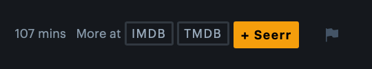
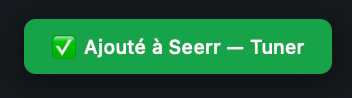

# Letterboxd to Seerr

[🇫🇷 Français](README.fr.md) | [🇬🇧 English](README.md)

## Supported languages

🇬🇧 English, 🇫🇷 French, 🇩🇪 German, 🇪🇸 Spanish, 🇮🇹 Italian, 🇵🇹 Portuguese, 🇯🇵 Japanese

The script automatically detects your browser language.

## Features

- One-click movie request from any Letterboxd film page
- Direct API call, no redirect, no search
- Checks for duplicates before sending the request
- Animated feedback notifications with movie title
- Works on any browser with a userscript manager

## Requirements

Your Seerr instance must be accessible over HTTPS from your browser. Due to browser security restrictions (mixed content policy), HTTP URLs will be blocked when used from HTTPS pages like Letterboxd.

We recommend using a reverse proxy (nginx, Caddy, NPM) with a valid SSL certificate in front of your Seerr instance.

## Installation

1. Install a userscript manager:
   - Safari (Mac): [Tampermonkey](https://apps.apple.com/fr/app/tampermonkey/id6738342400) *(recommended)*
   - Safari (Mac/iPhone): [Userscripts](https://apps.apple.com/app/userscripts/id1463298887) *(currently not supported due to extension limitations)*
   - Chrome/Firefox: [Tampermonkey](https://www.tampermonkey.net)

2. Click [here](https://raw.githubusercontent.com/MAT-GRC/letterboxd-seerr/main/letterboxd-seerr.user.js) to install the script

3. Edit the script and set your values:
   - `SEERR_URL` - your Seerr URL (e.g. http://192.168.1.x:5055)
   - `API_KEY` - found in Seerr, Settings, General, API Key

## Usage

Open any film page on Letterboxd. A `+ Seerr` button will appear next to the TMDB link. Click it to request the movie directly without leaving the page.

## License

MIT